# GamingServer

*	Difficult: `Eazy`
*	flagUser: `a5c2ff8b9c2e3d4fe9d4ff2f1a5a6e7e`
*	flagRoot: `2e337b8c9f3aff0c2b3e8d4e6a7c88fc`

## WriteUp

1. Сперва я решил сразу попробовать зайти по адресу и увидел простенький сайт. Если открыть исходный код там видно подсказку о том, что некого Джона просят поменять пароль

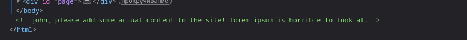

2. Немного потыкав имеющиеся вкладки, нахожу работающую вкладку Uploads, перейдя в неё я увидел такую картину

   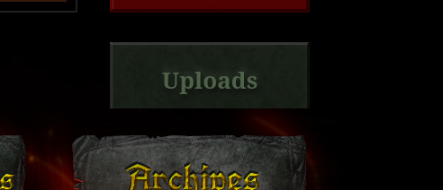
   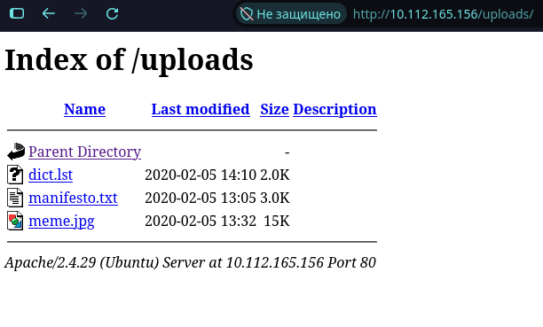                                 

3. Из интересного тут, только файл `dict.lst`. Пока не понятно что это именно, но похоже на обычный словарь для брута. 

   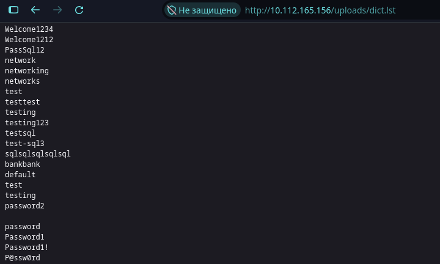 

4. Попробуем найти другие скрытые директории через инструмент `ffuf`. Использую обычный словарь и дефолт команду для демонстрации, так как вести себя скрытно нам тут не обязательно. Видимо прошлый файл который мы нашли, задумывался как раз для перебора директорий.

   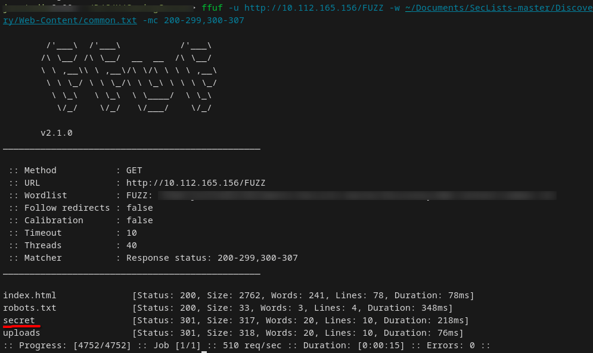 

5. После перехода в директорию `secret` , видим файл `secretKey`, который представляет собой приватный SSH ключ. 

   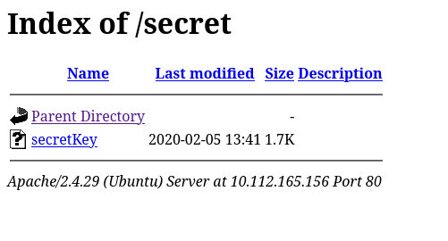 
   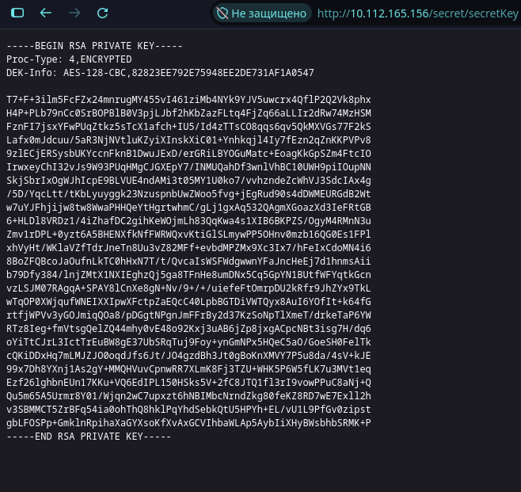 

6. Для демонстрации просканировал, но очевидно что нам нужен открытый порт SSH для подключения с помощью ключа который мы нашли. 

   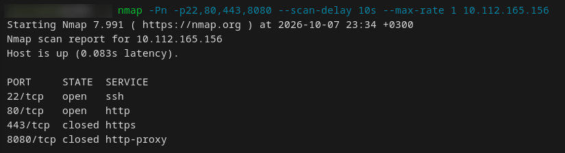 

7. Чтобы использовать скопированный приватный ключ, необходимо ограничить права доступа к нему, иначе SSH откажется подключаться из-за небезопасных разрешений

   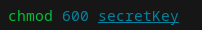 

8. Попытавшись использовать ключ для входа, оказывается, что он защищен паролем, по этому следующим шагом будет сбрутить его. 
   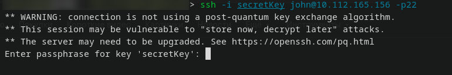 

9. Переводим ключ в нужный формат для John и брутим по славарю, за словарь я взял файл из 3 шага. Затем используем полученный пароль для входа.

   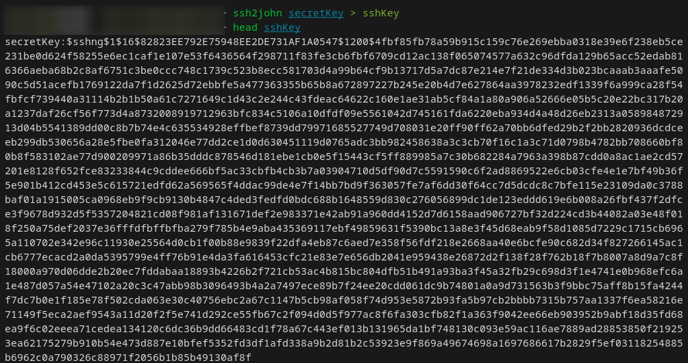 
   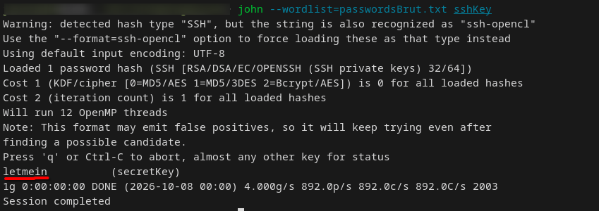 

   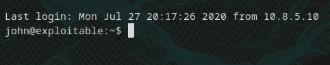 

10. Получаем первый флаг и сразу проверяю права, что у меня есть под данным пользователем

   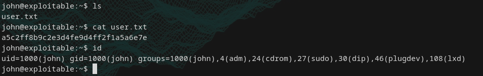 

11. Я выяснил что группа lxd позволяет управлять контейнерами и виртуальными машинами. Нашел информацию о том, что можно повысить привилегии через пользовательские тома. 

   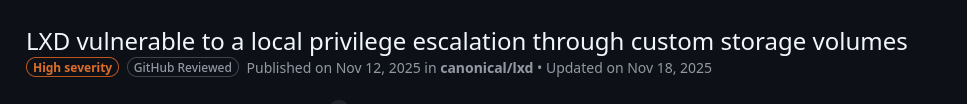 

12. Я клонировал репозиторий со скриптом, который создает образ Alpine Linux (он весит всего 5 мб и отлично подойдет для такой задачи). Теперь нам нужно его отправить цели. 

   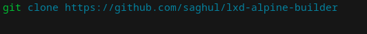 

13. Для отправки я поднял хттп сервер на атакующей машине, и с жертвы скачал образ.

   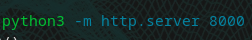 
   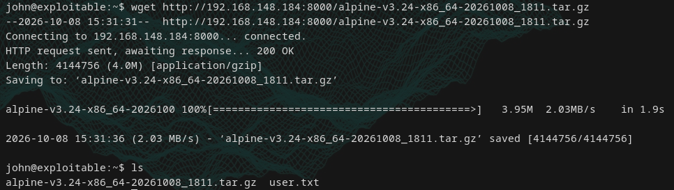 

14. Вся суть уязвимости заключается в том, что имея возможность управлять контейнерами, мы можем создать привилегированный контейнер с правами root и смонтировать всю систему хоста в него имея к ней полный доступ. Для этого мы импортируем скачанный образ в LXD, инициализируем контейнер и монтируем весь диск жертвы внутрь. 

   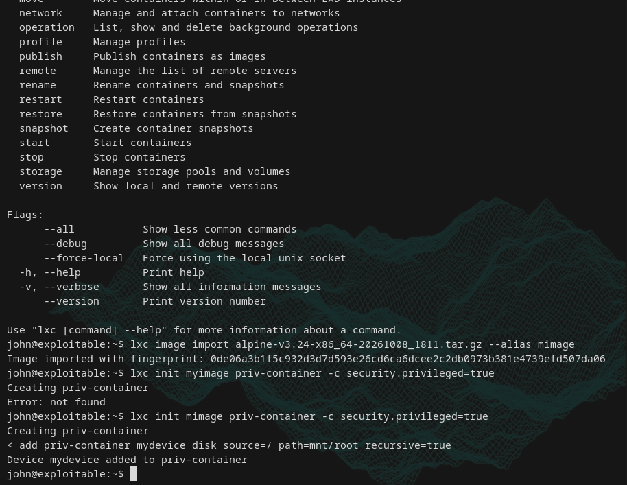 

15. Нам остаётся только запустить контейнер и зайти в него

   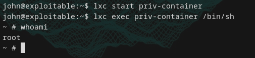 

16. А тут смонтированная система хоста прямо внутри контейнера в котором мы root 

   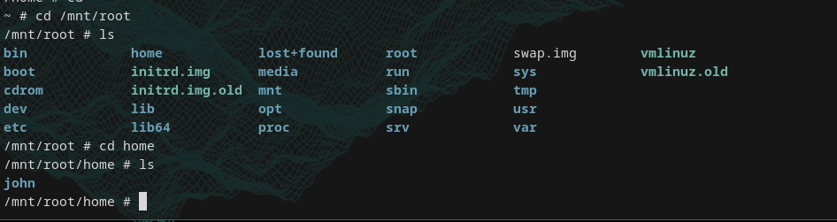 

17. получаем флаг

   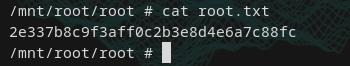 