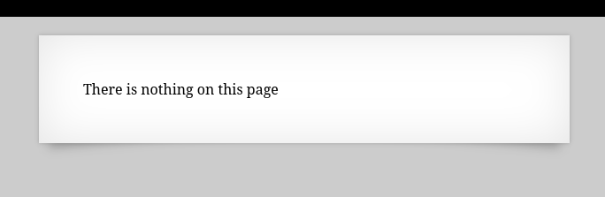
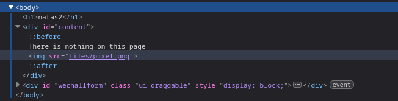
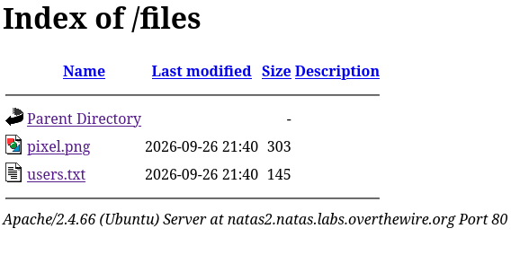
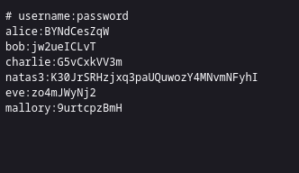

# Natas2

*	user: `natas2`
*	pass: `vsDOxoXyq3wckCP1ZmTZ71ngIA606odB`
*	url: `http://natas2.natas.labs.overthewire.org`
*	flag: `K30JrSRHzjxq3paUQuwozY4MNvmNFyhI`

## WriteUp
1. On this level, we are informed that the password is not on this page.

2. Open the source code of the page and notice that there is a directory containing an image.

3. Navigate to that directory and find another file named "users.txt." Accessing this file reveals the password for the next level. 