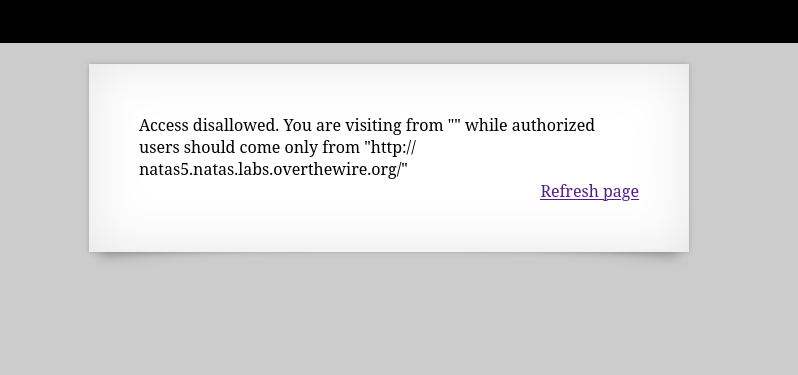
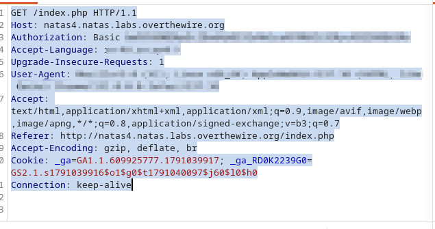
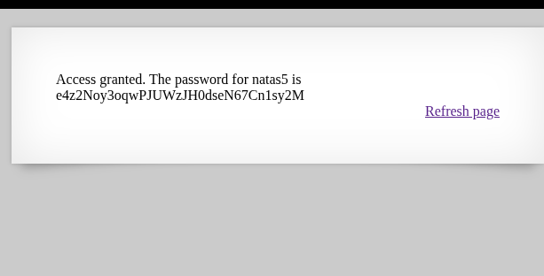

# Natas4

*	user: `natas4`
*	pass: `JDrPnuZAKyl6MkiqQGFIddrqpvgOASth`
*	url: `http://natas4.natas.labs.overthewire.org`
*	flag: `e4z2Noy3oqwPJUWzJH0dseN67Cn1sy2M`

## WriteUp
1. Upon visiting the website, it becomes clear that the server knows which page we came from and tells us which page we need to go to in order to access the site. Since we don't have the password for natas5 yet, we need to make the server think we came from there.

2. I will use Burp Suite for the demonstration. We need to modify the request so that the server thinks we arrived from the natas5 site. We can see the `Referer` parameter in the request, and we need to change it to the one we want. To do this, we click "Send to Repeater" and modify the request there. 

   
   

4. We send a request and see the flag 
   
   