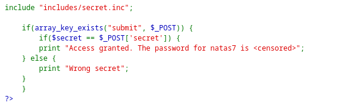
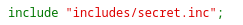
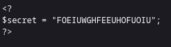
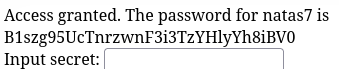

# Natas6

*	user: `natas6`
*	pass: `7mhjtShJAcld2NYbKHEadnhEwRn2P8VT`
*	url: `http://natas6.natas.labs.overthewire.org`
*	flag: `B1szg95UcTnrzwnF3i3TzYHlyYh8iBV0`

## WriteUp
1.  This service provides us with the source code for analysis.

2. The secret we are asked to enter is loaded from a file. 
   
    

4. We try to view this file and see a secret.
   
   

5. We enter it into the field on the website and get the password for the next level. 
   
    