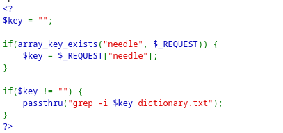
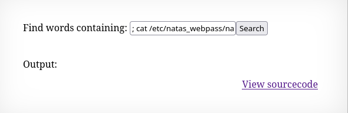
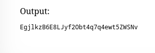

# Natas9

*	user: `natas9`
*	pass: `UdxmI27dTaXmnd1rxKQTfws6jihTdcQ9`
*	url: `http://natas9.natas.labs.overthewire.org`
*	flag: `EgjlkzB6E8LJyf2Obt4q7q4ewt5ZWSNv`

## WriteUp
1. In the original PHP code, we see that user data is passed to the command line and searched for in the file `dictionary.txt`.

   

2. Since there are no filters in place, we can simply terminate the `grep -i` command and write our own. To do this, we enter `; cat /etc/natas_webpass/natas10 #`. The `#` comments out everything that follows.

3. We are issued a password.

   