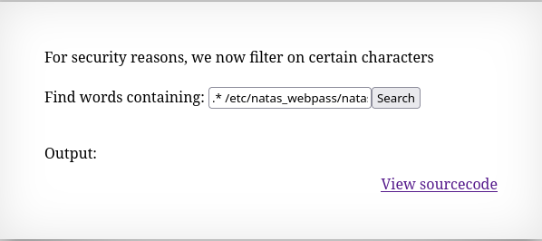
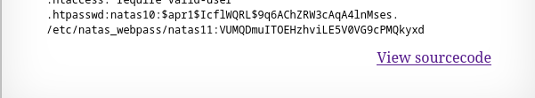

# Natas10

*	user: `natas10`
*	pass: `EgjlkzB6E8LJyf2Obt4q7q4ewt5ZWSNv`
*	url: `http://natas10.natas.labs.overthewire.org`
*	flag: `VUMQDmuITOEHzhviLE5V0VG9cPMQkyxd`
## WriteUp
1.  From the source code, we can see that this level is structured the same way as the previous one, except that now there is a filter.

   ![[natas10_source.png]]

2. In the previous task, we terminated the `grep` command and ran our own, but we don't even need to do that; `grep` itself will show us the file. If we add `.* /etc/natas_webpass/natas11 #`, the command will search for all lines in the file and comment out the output from `dictionary.txt`.

   
   