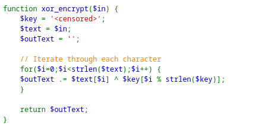
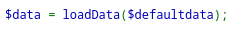
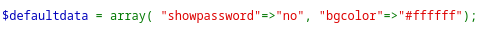
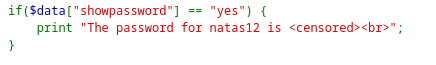
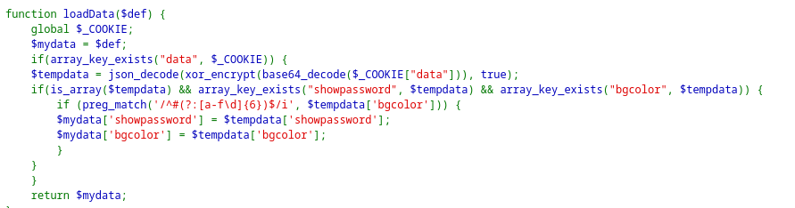
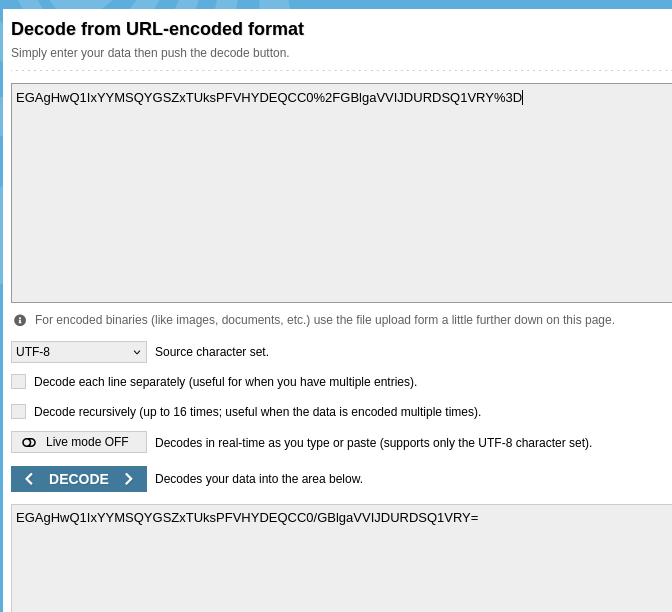
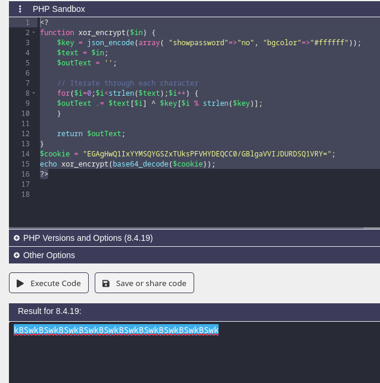
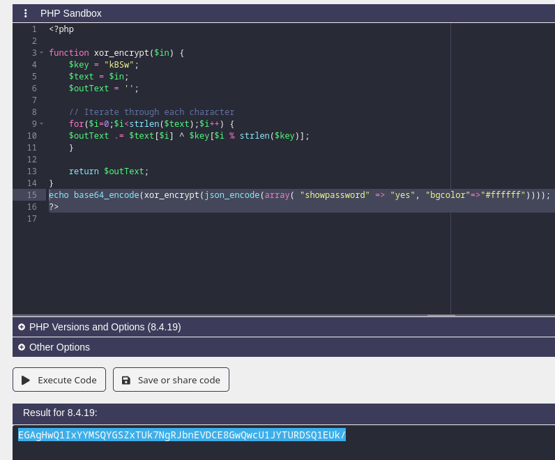
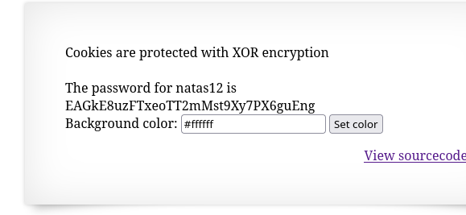

# Natas11

*	user: `natas11`
*	pass: `VUMQDmuITOEHzhviLE5V0VG9cPMQkyxd`
*	url: `http://natas11.natas.labs.overthewire.org`
*	flag: `EAGkE8uzFTxeoTT2mMst9Xy7PX6guEng`
## WriteUp

1. В данном фрагменте кода, мы видим, что используется XOR шифрование. Видим массив `$data`, который создаётся функцией `LoadData`, в которую в качестве параметра передается `$defaultdata` Ключа в коде нет, так что нам нужно будет его найти. 

   

   

   

2. Так же видим в конце такой фрагмент кода. Становится понятно, что для извлечения пароля, нужно сделать так, чтобы значение массива `$data` , было равно - `"showpassword"=>"yes", "bgcolor"=>"#ffffff"`

   

3. Здесь мы видим, что функция `LoadData` , загружает значение `$data` из cookie, кодирует в base64, шифрует XOR и декодирует в json. 

   

4. Получается, что для получения ключа, нам нужно взять данные из cookie и декодировать base64. Закодировать `$defaultdata` в json и сделать XOR двух этих строк. 

5. Нам известно что куки не совсем base64 и нам нужно привести их к нужному формату. Для этого я воспользовался рандомным сайтом в гугле. Это можно было сделать и руками но мне было лень. 

   

6. Мы немного переделываем исходный код, просто заставляя его выполнять обратную операцию из нашего `cookie` и извлекаем ключ. 

   

7. Мы видим что ключ циклический `"kBSw"` , А значит закодировав тем же алгоритмом действий `array( "showpassword" => "yes", "bgcolor"=>"#ffffff"` - мы получим нужные нам cookie. 

8. Далее, просто вставляем куки и обновляем страницу 

   